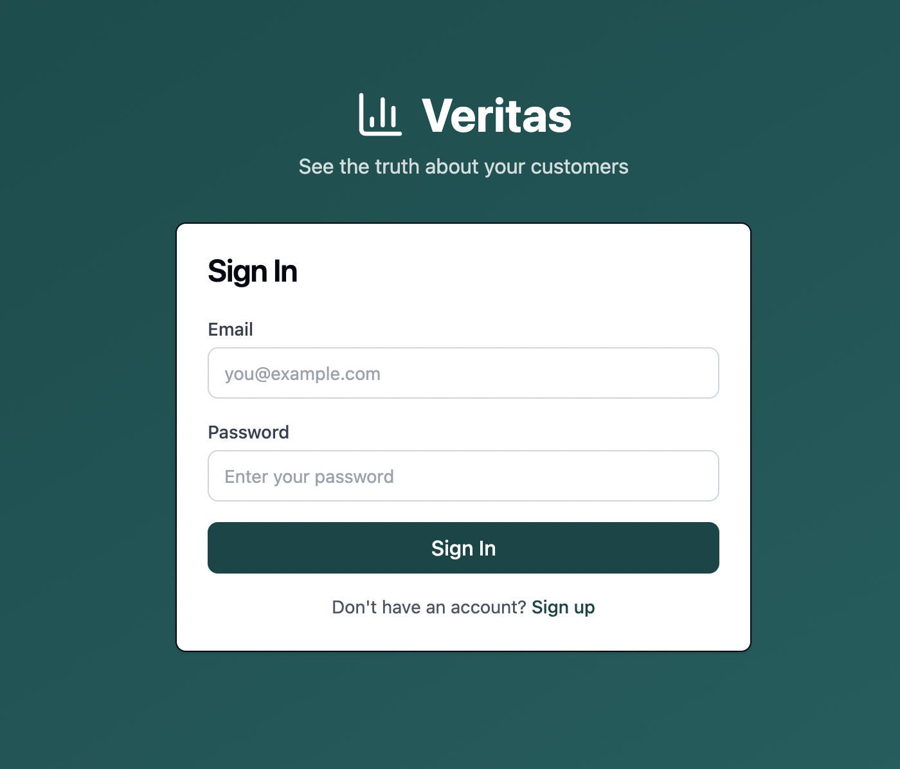
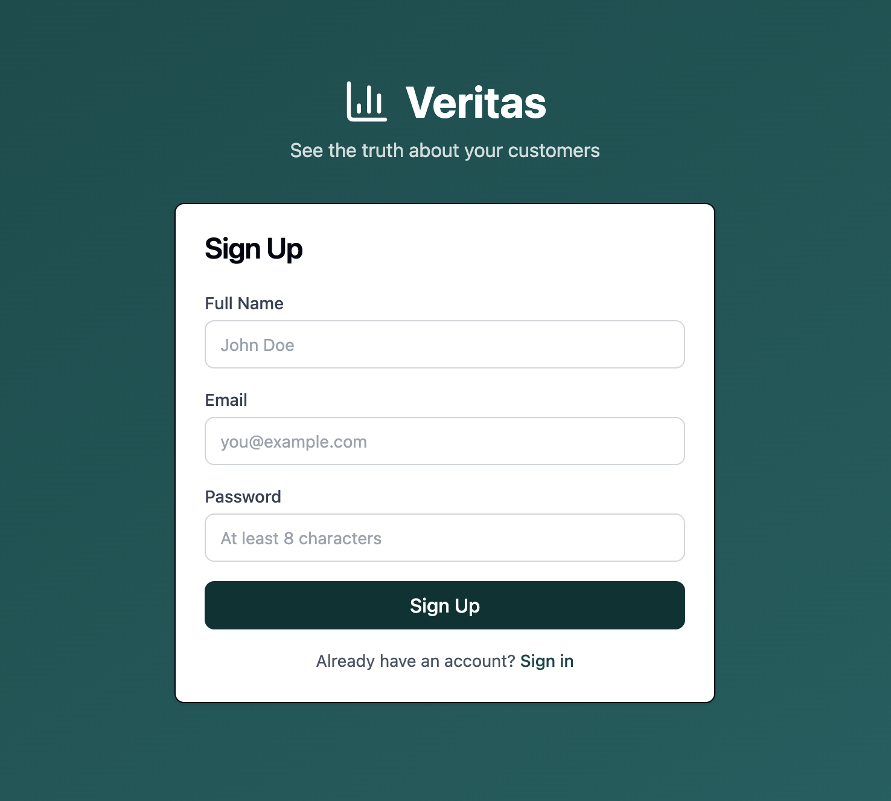
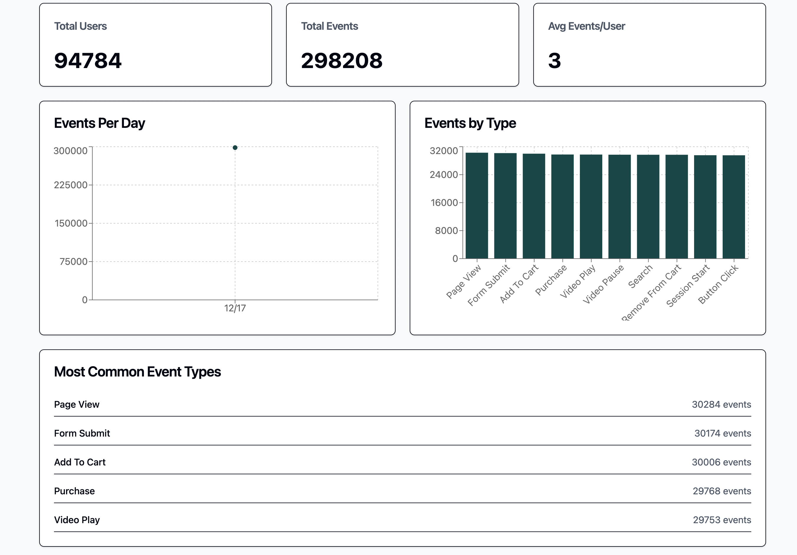
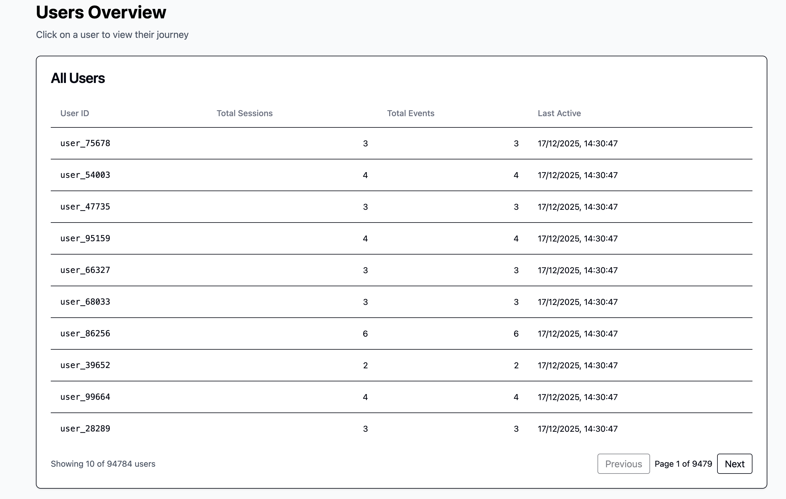
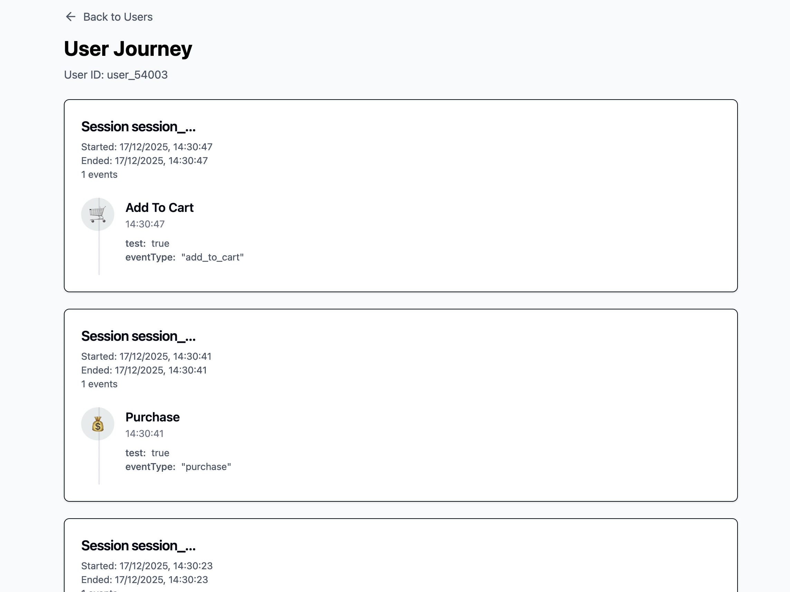

# Veritas - MarTech Event Analytics Platform

Event tracking and analytics for online shopping platforms. Handles 1M+ daily events across 500K+ users.

Reference implementation for scalable event ingestion and analytics systems.

## Table of Contents

- [What It Does](#what-it-does)
- [Architecture](#architecture)
- [Level Coverage](#level-coverage)
- [Event Flow](#event-flow)
- [What's Built](#whats-built)
- [Stack](#stack)
- [Deployment](#deployment)
- [API](#api)
- [UI Usage](#ui-usage)
  - [Login Page](#login-page)
  - [Sign Up Page](#sign-up-page)
  - [Dashboard](#dashboard)
  - [Users Overview](#users-overview)
  - [User Journey](#user-journey)
- [Event Types](#event-types)
- [Design Patterns](#design-patterns)
  - [Event Ingestion](#event-ingestion)
  - [Repository Pattern](#repository-pattern)
  - [Schema-First API](#schema-first-api)
  - [Monorepo with pnpm Workspaces](#monorepo-with-pnpm-workspaces)
- [Monitoring](#monitoring)
- [Performance](#performance)
- [Cost](#cost)
- [Project Structure](#project-structure)
- [Challenge: 5x Daily Events](#challenge-5x-daily-events)
  - [Design](#design)
  - [Infrastructure](#infrastructure)
  - [Load Testing](#load-testing)
  - [Capacity](#capacity)
  - [Event Type Expansion](#event-type-expansion)
- [Quick Start](#quick-start)
  - [Local Development](#local-development)
  - [Tests](#tests)
  - [Build](#build)
- [Security](#security)
- [Contributing](#contributing)
- [License](#license)

## What It Does

Ingests events in real time, tracks user activity, shows analytics dashboards. Designed and load-tested up to ~10,000 events/sec. Deployed with Infrastructure as Code on AWS.

The system buffers events in memory before writing to MongoDB in batches. This keeps the database from choking during traffic spikes. Events never get updated once written, only read.

Current load is 12 events/sec. Built to handle 10,000. That's 833x headroom.

## Level Coverage

Based on the implementation described in **What’s Built**:

- Database: L2 (Self hosted MongoDB schema + implementation)
- Backend/API: L5 (Deployed API, tests, daily export job)
- Cloud/DevOps: L4 (AWS infra, CloudFormation, CI/CD)
- Frontend: L4 (React app with forms & API integration)
- Dashboards: L3 (Grafana + CloudWatch)
- Challenge Covered: Increased daily events (5x)

## Architecture

```
┌─────────────────┐
│   React App     │
│  (Frontend)     │
│                 │
│  Vite + Tailwind│
└────────┬────────┘
         │ HTTPS
         ▼
┌─────────────────┐
│  CloudFront CDN │
│    (S3 Bucket)  │
└─────────────────┘

┌─────────────────┐
│  Express API    │
│   (Backend)     │      ┌──────────────┐
│                 │◄────►│   MongoDB    │
│  Event Buffer   │      │              │
│  + PM2 Cluster  │      └──────────────┘
└────────┬────────┘
         │
         ▼
┌─────────────────┐
│  Observability  │
│                 │
│                 │
│  CloudWatch     │
│  OpenTelemetry  │
└─────────────────┘
```

## Event Flow

```
POST /events (202) → Normalize → In-Memory Buffer → Batch Flush (200ms/2000 events) → MongoDB
                                        ↓
                                 Metrics
```

Events hit the API and return 202 immediately. Buffer flushes every 200ms or when it hits 2,000 events, whichever comes first. If the buffer reaches 10,000 events, new requests get rejected until it drains.

## What's Built

Database (L2):

- Mongoose schema with compound indexes
- Self hosted MongoDB, connection pooling
- No external integrations

Backend/API (L5):

- OpenAPI 3.0 spec, Swagger UI
- Express.js, layered architecture
- AWS EC2, Nginx, SSL/TLS
- Vitest, 5 test files
- Daily export job, S3 at 10 UTC

Cloud/DevOps (L4):

- Architecture diagrams
- Full AWS deployment running
- GitHub Actions for frontend
- CloudFormation with Makefile

Frontend (L4):

- User stories, wireframes
- React 19, Tailwind CSS v4
- Data viz with Recharts
- Auth forms, Zod validation
- S3 + CloudFront
- No admin panel (prioritized ingestion scalability over RBAC)

Dashboards (L4):

- OpenTelemetry + CloudWatch
- KPIs and charts with Recharts

## Stack

Backend: Node.js 20, Express.js 5, TypeScript 5.9.3, MongoDB (Mongoose 9), Better Auth 1.4.7, custom TypeScript validators, Vitest, OpenTelemetry + Winston, PM2

Frontend: React 19.2.0, Vite 7.2.4, TypeScript 5.9.3, Tailwind CSS v4.1.18, shadcn/ui, TanStack Query 5.90.12, React Router 7.10.1, Recharts 3.6.0, Zod

Infrastructure: AWS EC2 t3.micro (Free Tier), S3 + CloudFront, Self hosted MongoDB, CloudFormation, GitHub Actions, Nginx, Let's Encrypt SSL/TLS, CloudWatch + Grafana

Monorepo: pnpm workspaces. Fast, disk-efficient. 3x faster than npm, 2x faster than Yarn. Shared dependencies installed once at root. Parallel builds with `pnpm -r build`.

## Deployment

Production:

- Frontend: https://martech.mrsamdev.xyz
- Backend: https://api-veritas.mrsamdev.xyz
- API Docs: https://api-veritas.mrsamdev.xyz/api-docs
- Grafana: http://my-support-services-grafana-d8870c-194-238-23-211.traefik.me/d/tmsOtSxZk/amazon-ec2?orgId=1

Deploy to AWS:

```bash
aws configure
cp .env.example .env.production
# Edit .env.production with real values
make deploy
make status
make outputs
```

Deploy frontend with git tags:

```bash
git tag v1.0.0
git push origin v1.0.0
# GitHub Actions handles the rest
```

Infrastructure commands:

```bash
make deploy          # Deploy/update stack
make delete          # Delete stack (asks first)
make status          # Check stack status
make describe        # Stack resources
make validate        # Validate template
make events          # Stack events
```

## API

Authentication:

- `POST /api/auth/sign-up/email` - Register
- `POST /api/auth/sign-in/email` - Login
- `POST /api/auth/sign-out` - Logout
- `GET /api/auth/get-session` - Current session

Events:

- `POST /events` - Ingest events (public, 202 Accepted)
- `GET /users/:userId/journey` - User journey (protected)

Analytics:

- `GET /stats` - System stats and KPIs (protected)
- `GET /users` - List users (protected)

Health:

- `GET /health` - Health check, database status

Full docs at `/api-docs`. Try requests directly in the browser.

## UI Usage

### Login Page



**Flow:**

1. User enters email and password
2. Form validates input with Zod schema
3. On successful sign in, redirects to Dashboard
4. New users can click "Sign up" link to register

### Sign Up Page



**Flow:**

1. User enters full name, email, and password (minimum 8 characters)
2. Form validates input with Zod schema
3. On successful registration, account is created
4. Redirects to Dashboard
5. Existing users can click "Sign in" link

### Dashboard



**Flow:**

1. After login, user lands on Dashboard
2. View KPI cards: Total Users, Total Events, Avg Events/User
3. Analyze charts: Events Per Day (line chart), Events by Type (bar chart)
4. Review Most Common Event Types table
5. Navigate to Users page or Logout via top navigation

### Users Overview



**Flow:**

1. Click "Users" link in top navigation
2. View paginated table of all users with metrics
3. See User ID, Total Sessions, Total Events, Last Active timestamp
4. Click any user row to view their journey
5. Use pagination controls to browse through users

### User Journey



**Flow:**

1. Click a user row from Users Overview
2. View user's complete event timeline grouped by session
3. See session details: Session ID, start/end time, event count
4. Review individual events with icons, timestamps, and metadata
5. Click "Back to Users" to return to Users Overview

## Event Types

10 supported event types: `session_start`, `page_view`, `search`, `purchase`, `add_to_cart`, `remove_from_cart`, `button_click`, `form_submit`, `video_play`, `video_pause`.

Adding new types takes three steps:

1. Update the enum in `packages/types/src/event.types.ts`:

```typescript
export enum EventType {
  // ... existing types
  CHECKOUT_START = "checkout_start",
  PAYMENT_FAILED = "payment_failed",
}
```

2. Rebuild types:

```bash
pnpm --filter @martech/types build
```

3. Done. Backend validators enforce it, frontend autocomplete knows about it, API docs update, database accepts it.

Scales to 100+ event types without refactoring.

## Design Patterns

### Event Ingestion

Buffer-based batching. Events collect in memory, flush to MongoDB in batches. Two triggers: 200ms timer or 2,000 events.

Gets you 10,000 events/sec capacity, reduced database load, backpressure handling when the buffer hits 10,000.

If the buffer reaches capacity, the API applies backpressure by rejecting new events with 429 until the buffer drains.

Code: [apps/api/src/services/eventIngestion.service.ts](apps/api/src/services/eventIngestion.service.ts)

### Repository Pattern

Database access isolated in the repository layer:

```
Controller → Service → Repository → MongoDB
```

Testable business logic without mocking the database. Easy to swap data sources. HTTP stays separate from business logic, business logic stays separate from data access.

### Schema-First API

Shared types package keeps everything consistent:

```
Backend: Custom TS Validators → Shared Types Package → Frontend: Zod Validation
```

Backend uses lightweight TypeScript validation. Runtime checks, no external dependencies. Frontend uses Zod for forms and API responses. Both share types from `@martech/types`.

### Monorepo with pnpm Workspaces

```
martech/
├── pnpm-workspace.yaml       # Workspace config
├── apps/
│   ├── api/                  # Backend
│   └── web/                  # Frontend
└── packages/
    └── types/                # Shared types
```

Why pnpm? Saves disk space with content-addressable storage. One copy of each package version, ever. Strict dependency resolution prevents phantom dependencies. Built-in workspace support.

Commands:

- `pnpm -r build` - Parallel builds
- `pnpm -r --parallel dev` - Run all services
- `pnpm --filter api test` - Filter specific packages

## Monitoring

Metrics collected:

Event Ingestion: total events by type and status, latency histogram, real-time buffer size, flush operations counter

Database: connection pool status, query duration (p50, p95, p99), operation counts

HTTP: request counts by route and method, response times, error rates

System: memory usage (heap, RSS, external), CPU usage, GC metrics

Access metrics:

- CloudWatch: AWS Console
- Grafana: [Production Dashboard](http://my-support-services-grafana-d8870c-194-238-23-211.traefik.me/d/tmsOtSxZk/amazon-ec2?orgId=1)

CloudWatch + Grafana setup:

```
EC2 Instance → CloudWatch Agent → CloudWatch → Grafana Data Source
```

CloudWatch collects system metrics (CPU, memory, disk), application logs (PM2, Nginx), custom namespaces (MartechAPI). Grafana shows real-time dashboards for EC2 health, custom panels for event ingestion, alerts for threshold breaches.

## Performance

Buffer size: 2,000 events
Flush interval: 200ms
Backpressure threshold: 10,000 events
Max concurrent flushes: 3
Database indexes: Compound index on userId + occurredAt
Connection pool: 10 connections
Target latency: <100ms p99

## Cost

Runs on AWS and MongoDB free tiers. EC2 t3.micro (750 hours/month), S3 + CloudFront (minimal usage), Selfhosted MongoDB (minimal usage), CloudWatch (basic monitoring).

Current cost: $0/month.

## Project Structure

```
martech/
├── apps/
│   ├── api/              # Backend API
│   │   ├── src/
│   │   │   ├── controllers/   # HTTP handlers
│   │   │   ├── services/      # Business logic
│   │   │   ├── repositories/  # Data access
│   │   │   ├── models/        # Mongoose schemas
│   │   │   ├── middleware/    # Express middleware
│   │   │   ├── validators/    # Zod schemas
│   │   │   ├── observability/ # Telemetry
│   │   │   └── jobs/          # Scheduled jobs
│   │   └── tests/
│   │
│   └── web/              # Frontend React app
│       ├── src/
│       │   ├── pages/         # Page components
│       │   ├── components/    # Reusable components
│       │   ├── lib/           # API layer + utilities
│       │   └── hooks/         # React hooks
│       └── dist/
│
├── packages/
│   └── types/            # Shared TypeScript types
│
├── infra/
│   ├── cloudformation.yaml    # AWS IaC
│   └── cloudwatch-config.json # Monitoring config
│
├── .github/
│   └── workflows/        # CI/CD
│
├── Makefile              # Infrastructure commands
└── pnpm-workspace.yaml   # Monorepo config
```

## Challenge: 5x Daily Events

Selected challenge: "Increased number of daily events by 5 times"

The system handles a 5x increase in daily event volume (1M to 5M events/day) through buffered ingestion, batch database writes, append-only event storage. Load testing validates the design.

Key implementation files:

- Event ingestion: [apps/api/src/services/eventIngestion.service.ts](apps/api/src/services/eventIngestion.service.ts)
- Batch writes: [apps/api/src/repositories/event.repository.ts](apps/api/src/repositories/event.repository.ts)
- Schema design: [apps/api/src/models/Event.ts](apps/api/src/models/Event.ts)
- Infrastructure: [infra/cloudformation.yaml](infra/cloudformation.yaml)
- Metrics: [apps/api/src/observability/](apps/api/src/observability/)

### Design

In-memory buffering: Events collect in memory before database writes. Dual-trigger flushing (time-based + size-based). Prevents database overload during spikes.

Batch database writes: Bulk inserts with MongoDB `insertMany()`. Up to 2,000 events per batch. Ordered inserts, duplicate handling.

Write-optimized schema: Append-only event storage. No updates. Compound index on `(userId, occurredAt)` for reads. Using `eventId` as `_id` saves 12 bytes per document.

### Infrastructure

Long-running service: EC2 with PM2 process manager. Auto-restart on crashes. Cluster mode ready for multi-core.

Horizontal scalability: Stateless API. No in-memory session storage. Load balancer support ready. MongoDB connection pooling (10 connections). Each instance handles independent traffic.

Monitoring: CloudWatch + Grafana dashboards. Buffer size and flush rate tracking.

### Load Testing

k6 load test results:

- 300,000 events in 30 seconds (~10,000 events/sec)
- p95 latency: <50ms
- Failure rate: 0%
- 5x target: 5M events/day = ~58 events/sec (173x headroom)

Test config:

```javascript
// Sustained high load
export const options = {
  stages: [
    { duration: "10s", target: 100 }, // Ramp up
    { duration: "30s", target: 500 }, // Sustained load
    { duration: "10s", target: 0 }, // Ramp down
  ],
};
```

### Capacity

| Metric          | Current Load | 5x Load | Tested Capacity             | Status |
| --------------- | ------------ | ------- | --------------------------- | ------ |
| Daily Events    | 1M           | 5M      | 300K in 30s (load tested)   | Ready  |
| Events/Second   | ~12          | ~58     | ~10,000                     | Ready  |
| Buffer Flushes  | ~6/sec       | ~29/sec | 5 flushes/sec × 2000 events | Ready  |
| Database Writes | Batch        | Batch   | Bulk inserts                | Ready  |

### Event Type Expansion

Also handles increased number of supported event types through enum-based validation.

Current: 10 event types
Scalability: Update the enum in `packages/types/src/event.types.ts`

Benefits: Type-safe across entire system, automatic backend validation, frontend autocomplete updates, no database schema changes, scales to 100+ event types.

Example:

```typescript
export enum EventType {
  // Existing 10 types...
  CHECKOUT_START = "checkout_start",
  PAYMENT_METHOD_SELECTED = "payment_method_selected",
  // ... add more
}
```

## Quick Start

Prerequisites: Node.js 20+, pnpm 10.25.0+, MongoDB (local or Atlas), AWS Account (for deployment)

### Local Development

Clone:

```bash
git clone <repository-url>
cd martech
```

Install:

```bash
pnpm install
```

Configure:

```bash
cp .env.example .env
# Edit .env with MongoDB URI and settings
```

Start:

```bash
# All services
pnpm dev

# Or individually
cd apps/api && pnpm dev    # Backend on http://localhost:3000
cd apps/web && pnpm dev    # Frontend on http://localhost:5173
```

Access:

- Frontend: http://localhost:5173
- API: http://localhost:3000
- API Docs: http://localhost:3000/api-docs
- Health: http://localhost:3000/health

### Tests

```bash
pnpm test                      # All tests
pnpm --filter api test:watch   # Watch mode
pnpm --filter api test:coverage # Coverage
pnpm --filter api test:ui       # UI mode
```

### Build

```bash
pnpm build                           # All packages
pnpm --filter @martech/types build   # Specific package
pnpm --filter api build
pnpm --filter web build
```

## Security

SSL/TLS encryption for all endpoints. Better Auth with secure session cookies. MongoDB connection with TLS. IAM roles for AWS resources. CORS configured for allowed origins. Environment variables with NoEcho in CloudFormation. Custom TypeScript validators for runtime type safety.

## License

MIT
